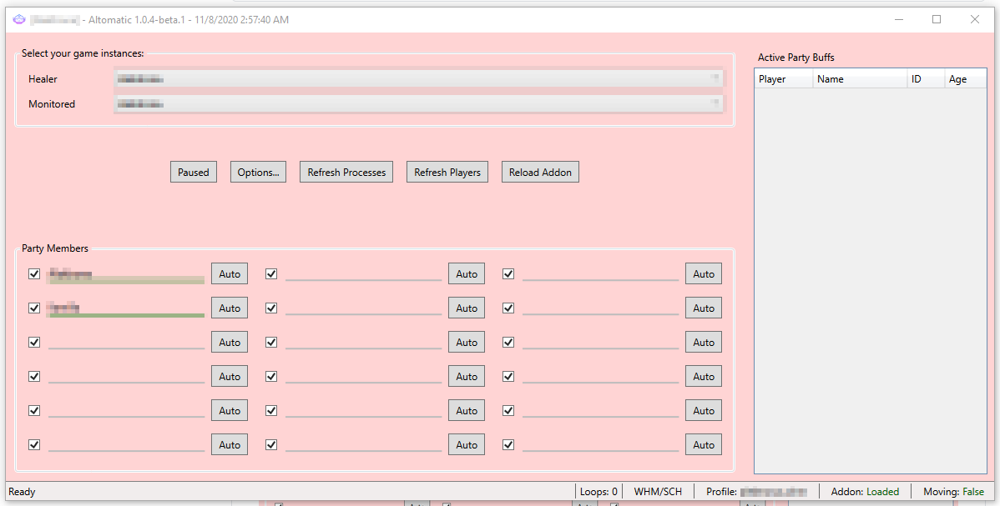
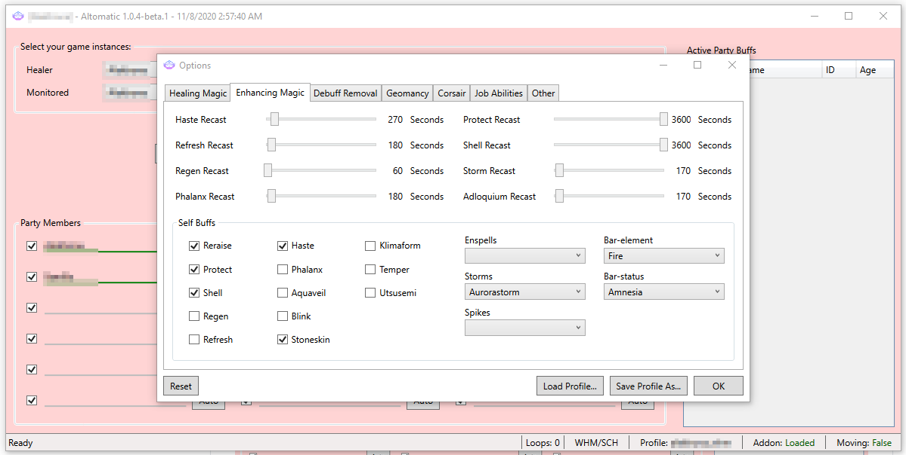

# Altomatic

Altomatic is an FFXI alt bot inspired by the hard work of atom0s and Daniel Hazzard over at [Cure Please](https://github.com/DanielHazzard/Cure-Please). It offers mostly the same features, but with a simplified UI and smarter player management. I originally attempted to fork the original project and apply any fixes I found necessary, but it eventually became too cumbersome to work with the legacy code base.

## Major Changes From Cure Please

Aside from many bug fixes and optimizations, the primary differences in Altomatic are:

- **Integrated Corsair roll bot** - Altomatic includes Corsair roll automation natively. No need for a second bot or lua!
- **Smarter character management** - The AI will make many decisions for you. It is no longer necessary to specify the tier of enhancement spells and status removal items, among other things. It will, for example, cast Phalanx I on self, but Phalanx II on others, and will cast the highest available tiers for the various enhancement spells (Haste, Refresh, etc.). If configured, it will automatically try hallowed, then holy water before attempting to use Cursna. Likewise with echo drop and remedies.
- **Better addon integration** - Running a helper addon is no longer optional, but it is now more convenient to do so, especially with multiple characters. A port is dynamically selected and communicated to the addon for each separate running instance. It is no longer necessary to save separate port settings per profile.
- **Easiser profile autoload** - The bot will now automatically try to load profiles using either the `{playerName}_{jobName}.xml` or `{jobName}.xml` syntax. All profiles are stored in the .\\settings subdirectory and automatically saved/loaded each time the options change.

There is some reduced flexibility in configuring various options, but the defaults will suit most people fine. If not, you can always fork it! This program was designed specifically to streamline the process of multiboxing. Many of the micromanagement details were discarded on purpose.

## Credits

This project would not exist without the hard work and dedication of the fine people from the [EliteMMO network](http://www.elitemmonetwork.com/) and the [Ashita project](https://www.ashitaxi.com/). We proudly stand on the shoulders of giants to make this possible.
